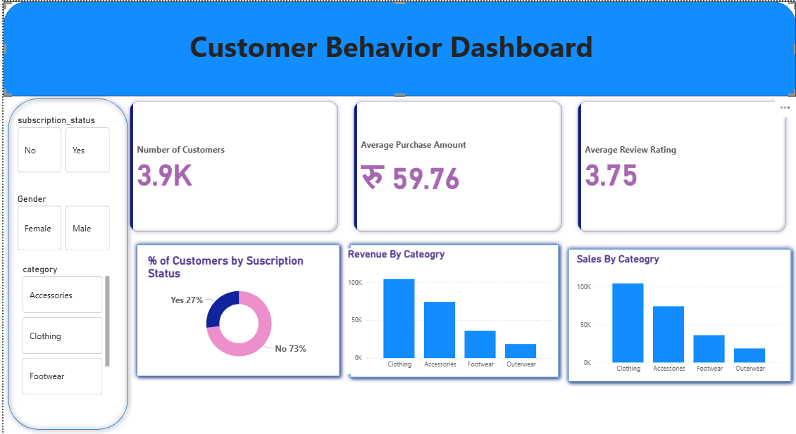
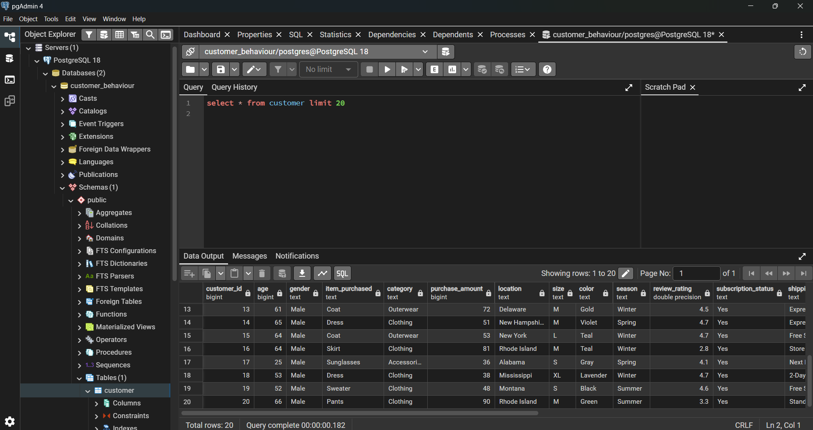
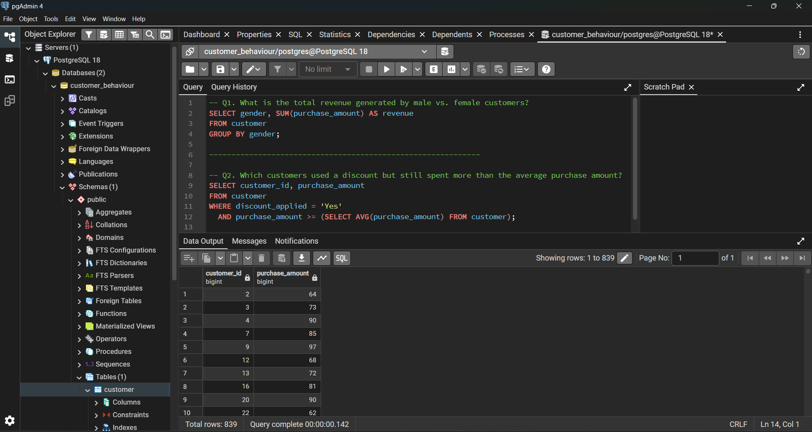
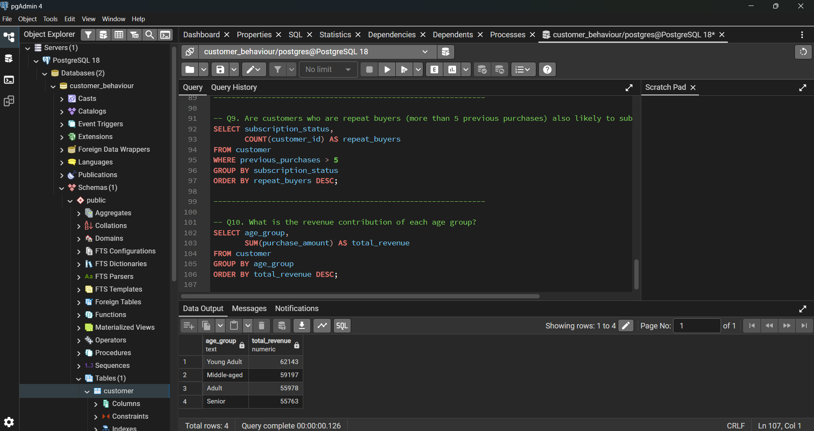

# Customer_Behaviour_Analysis
Data analytics project showcasing customer behaviour using python,sql and power Bi

📌 Project Overview

This project shows a complete data analytics workflow — from raw data to business insights.

✅ Data Preparation & Analysis (Python): Clean and prepare the data for analysis.

✅ Data Exploration (SQL): Use SQL queries to find insights about customers, their loyalty, and purchase behavior.

✅ Visualization (Power BI): Create an interactive dashboard to display key trends and help in making data-driven decisions.

## 📊 Dashboard Preview

## Sql Queries in postgresql 

## 📊 Jupyter Notebook Files

!(Images/Img6.png)
!(Images/Img7.png)

